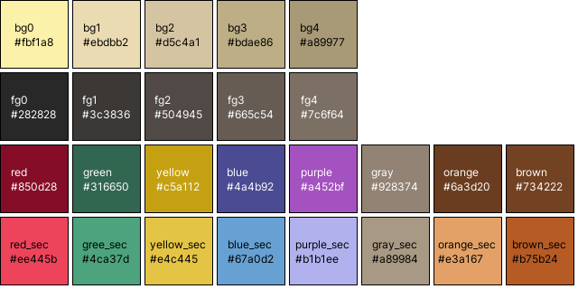
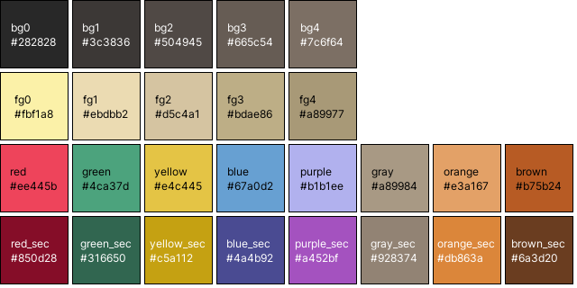

# hackdornfish
a simple color code for my desktop environment inspired by gruvbox.

## table of contents

[1. concept](#sec1)\
[2. light mode](#sec2)\
[3. dark mode](#sec3)\
[4. the python script](#sec4)\
[5. the signature](#sec5)\
[6. roadmap](#sec6)


## 1. concept <a name="sec1"></a>   
the concept is straightforward: i used to use Hyprland with Waybar and some Rofi applications, and i want them to look visually appealing. the rest of the configuration is stored in a private repository to ensure no sensitive data is leaked.

as someone who enjoys working outdoors, i appreciate the ability to see my screen clearly even in bright sunlight. therefore, i've developed a color set for both dark and light modes. my color scheme draws inspiration from [gruvbox](https://github.com/morhetz/gruvbox), a well-known and functional color scheme that provides a nice contrast.

the color names should be self-explanatory, with bg 0-4 representing background and fg 0-4 representing foreground.

## 2. light mode <a name="sec2"></a>


## 3. dark mode <a name="sec3"></a>


## 4. python script <a name="sec4"></a>
the python script works with a CSS script as input, where colors need to be defined like this:

```css
@define-color black #ffffff;
```
 
each free line in the CSS code acts as a Backspace for the boxes in the output .png file.

## 5. the signature <a name="sec5"></a>

the signature directory contains an html script with a css style sheet to create an appealing email signature. it uses the defined colors and is created along the neumorphistic design language 

## 6. roadmap <a name="sec6"></a>

- [ ] gather more opinions on colors.
- [ ] get the hackdornfish in there

